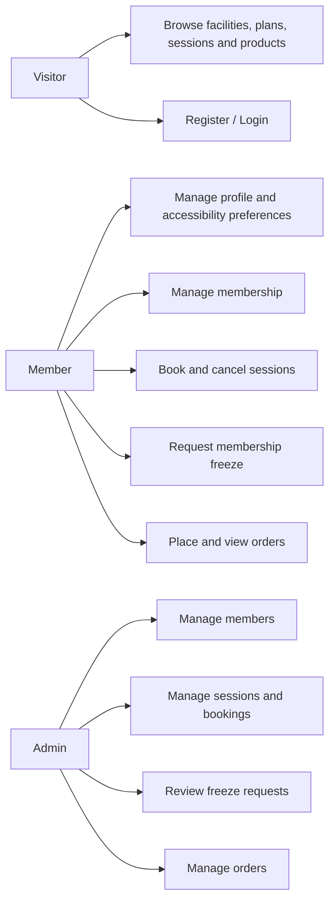
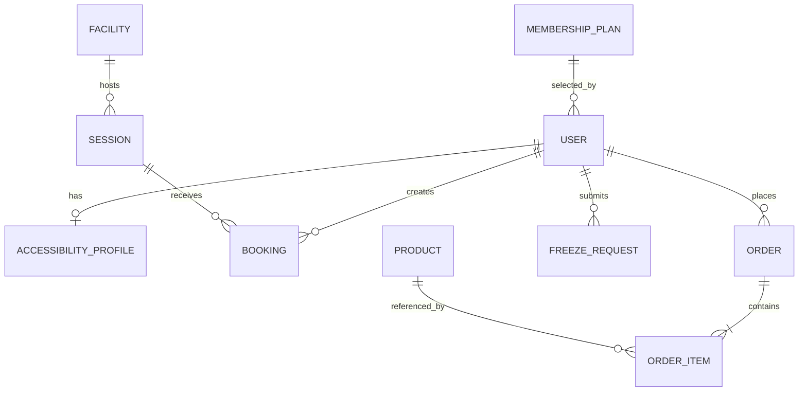
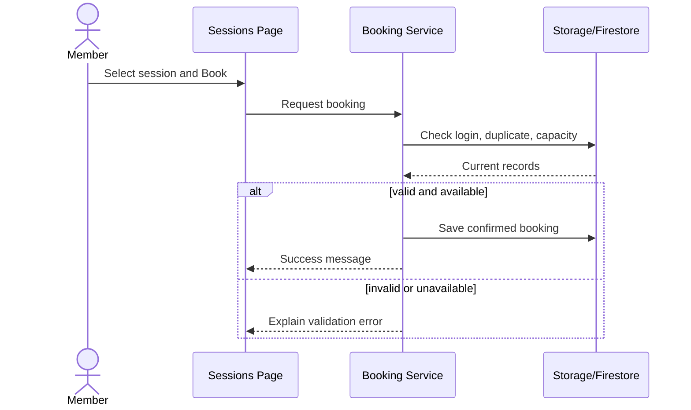
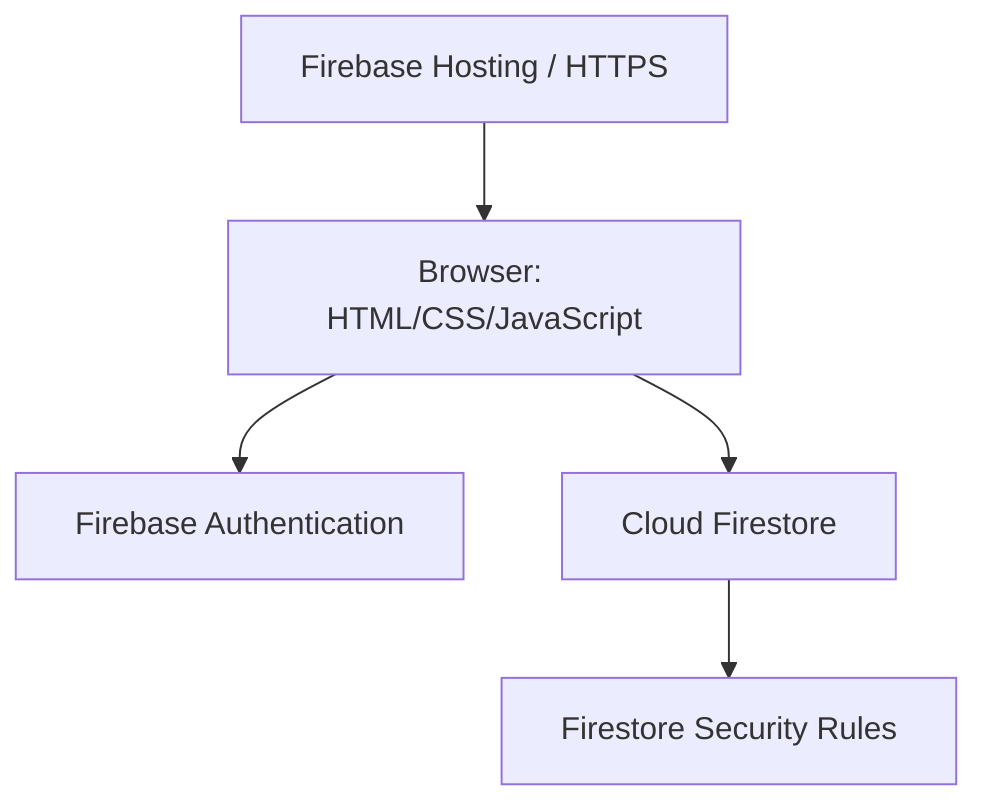

# System Diagrams

## Use-case overview

```mermaid
flowchart LR
  Visitor --> Browse[Browse facilities, plans, sessions and products]
  Visitor --> Register[Register / Login]
  Member --> Profile[Manage profile and accessibility preferences]
  Member --> Membership[Manage membership]
  Member --> Booking[Book and cancel sessions]
  Member --> Freeze[Request membership freeze]
  Member --> Order[Place and view orders]
  Admin --> Members[Manage members]
  Admin --> Sessions[Manage sessions and bookings]
  Admin --> Requests[Review freeze requests]
  Admin --> Orders[Manage orders]
```

## Logical data model

```mermaid
erDiagram
  USER ||--o| ACCESSIBILITY_PROFILE : has
  USER ||--o{ BOOKING : creates
  USER ||--o{ ORDER : places
  USER ||--o{ FREEZE_REQUEST : submits
  MEMBERSHIP_PLAN ||--o{ USER : selected_by
  SESSION ||--o{ BOOKING : receives
  FACILITY ||--o{ SESSION : hosts
  ORDER ||--|{ ORDER_ITEM : contains
  PRODUCT ||--o{ ORDER_ITEM : referenced_by
```

## Booking sequence

```mermaid
sequenceDiagram
  actor M as Member
  participant UI as Sessions Page
  participant S as Booking Service
  participant DB as Storage/Firestore
  M->>UI: Select session and Book
  UI->>S: Request booking
  S->>DB: Check login, duplicate, capacity
  DB-->>S: Current records
  alt valid and available
    S->>DB: Save confirmed booking
    S-->>UI: Success message
  else invalid or unavailable
    S-->>UI: Explain validation error
  end
```

## Deployment architecture

```mermaid
flowchart TB
  Browser[Browser: HTML/CSS/JavaScript] --> Auth[Firebase Authentication]
  Browser --> Firestore[Cloud Firestore]
  Firestore --> Rules[Firestore Security Rules]
  Hosting[Firebase Hosting / HTTPS] --> Browser
```
